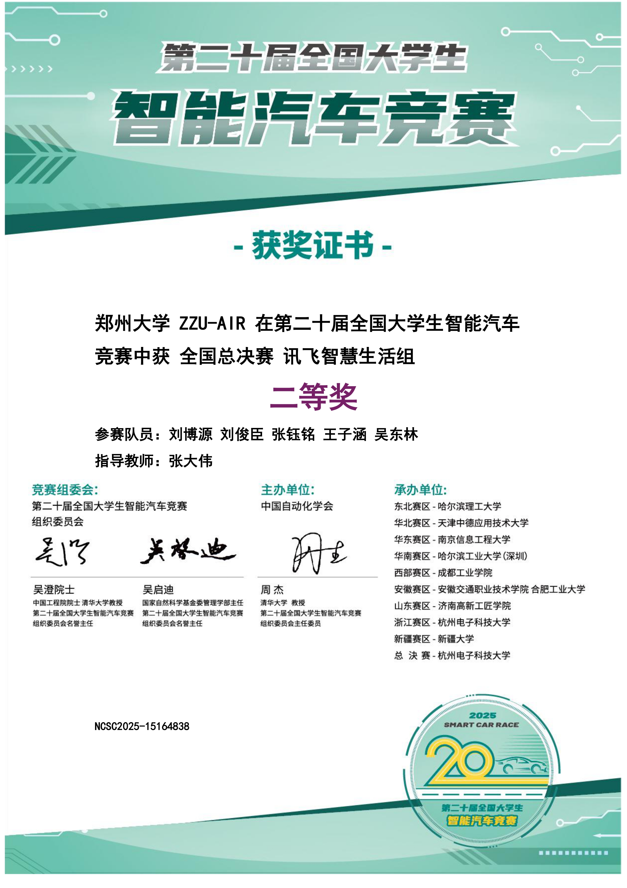
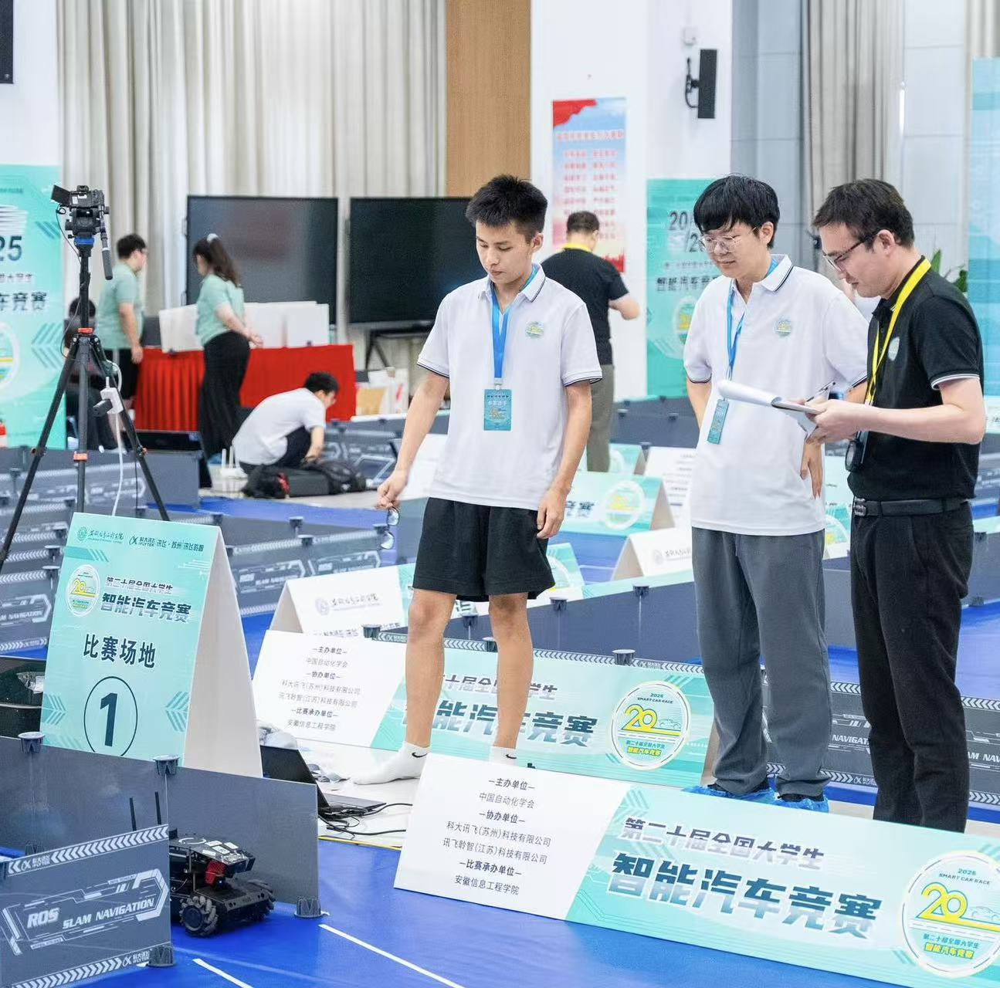
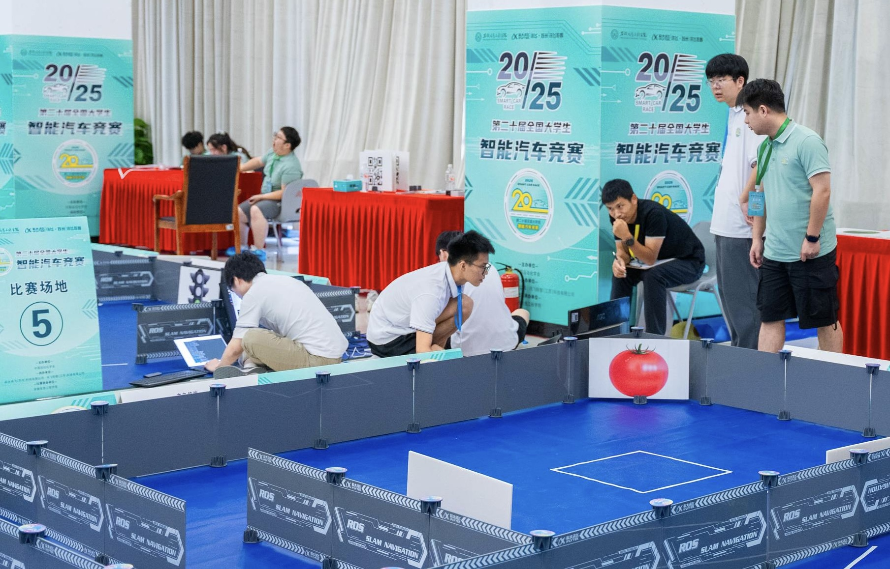
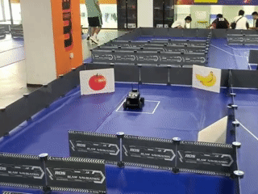
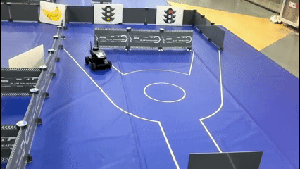
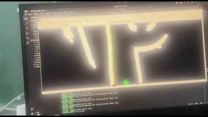
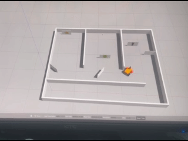
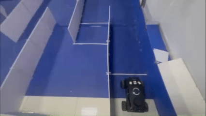
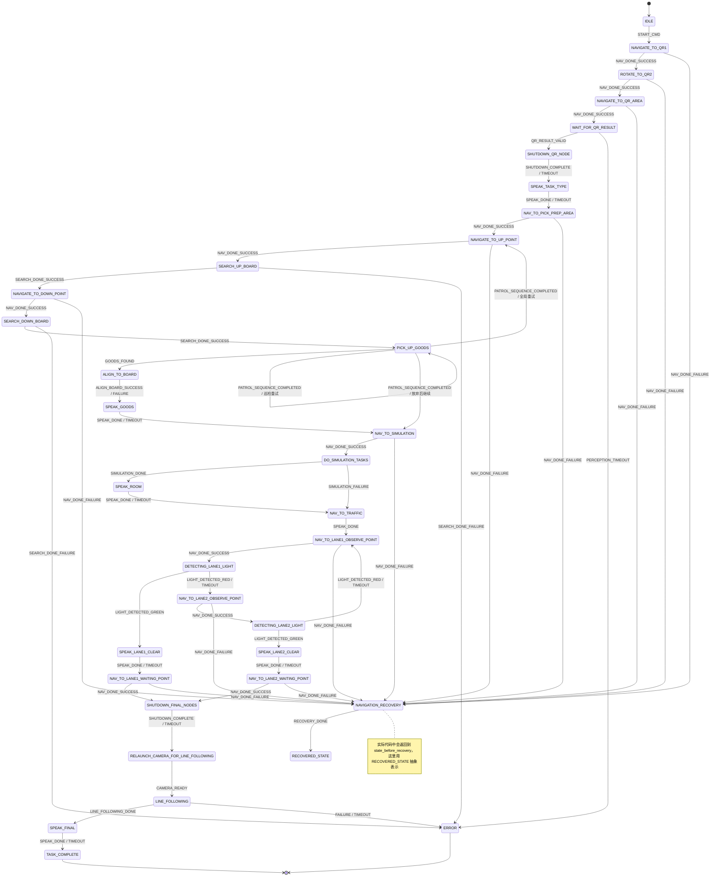

> 当前仓库为 monorepo，本 README 主要介绍 `UCAR/` 子项目；其余子项目见 `UCAR-PC/` 与 `UCAR-FOLLOW-LINE/`。

# 仓库说明

## 📖 项目概述

本项目是为第二十届 **全国大学生智能汽车竞赛：讯飞创意组** 设计的 ROS 工作空间，整合了比赛所需的核心算法与功能包。

## 🏆 赛事成绩

在 第二十届 **全国大学生智能汽车竞赛：讯飞创意组** 中，本项目方案荣获 **全国二等奖**。

  

  

  

> 本次比赛最终获得了全国二等奖，首先要感谢刘俊臣学长的支持与帮助。还记得大二下学期时，我还是ROS零基础的小白，却毅然接手了讯飞项目。那一个学期里，我将大部分精力投入比赛，没想到最后专业成绩还能提升，算是意外之喜。
>
> 讯飞比赛对个人而言挑战极大，涵盖了 **YOLO目标检测、导航、语音交互、二维码识别、仿真、巡线、状态机** 等几乎本科竞赛常用的技术。这一路基本是我独自走过来的，过程艰辛，但结果值得。
>
> 想对后续的参赛同学说：讯飞需要志同道合的队友，大家齐心协力、坚持不懈，才可能取得好成绩。单打独斗很难走远。今年甚至要接近95分的高速成绩才能进国赛，难度可见一斑。
>
> 今年的圆满收官也弥补了去年的遗憾，我的竞赛生涯至此画上了句号。

# 效果演示

#### 聚类找板演示

   

#### 巡线

   

#### 巡线上位机调参

   

#### 仿真

   

#### 全流程

   

## 结构说明

`UCAR/src` 目录下包含以下基础功能包：

- **ydlidar**: 激光雷达基础驱动包
- **xf_mic_asr_offline**: 麦克风基础驱动包
- **ucar_nav**: 导航基础驱动包
- **ucar_controller**: 底盘控制基础驱动包
- **lby_usb_cam**: 摄像头基础驱动包

具体启动的 `launch` 文件请查看 `UCAR/src/state_machine` 中比赛的 `launch` 文件。

## 功能包说明

1. **qr_code**
   - 功能：二维码识别节点，订阅摄像头数据，发布解析得到的文本信息。

2. **board_detect**
   - 功能：找板脚本对应的功能包，输出物品板正前方正对物品板的目标姿态，并保存到 `yaml` 文件夹中以便后续读取。

3. **board_detect_state_machine**
   - 功能：开发找板时新开的状态机功能包，主要用于后半平面的状态机开发，完成后合并到主状态机。

4. **darknet_ros**
   - 功能：`darknet_ros` 是 `yolov3` 对应的功能包，输入摄像头话题数据，返回检测过的图像。不过因为 `darknet_ros` 是一个 git 仓库，我没有对其追踪，源码从 `darknet_ros` 的官方仓库 clone 就行。

5. **follow_line**
   - 功能：巡线功能包，启动后接受服务调用，开始巡线，包含国赛和省赛的巡线脚本。

6. **state_machine**
   - 功能：最最最最最核心的功能包!!! 比赛的核心大脑节点，主状态机功能包，控制整个比赛流程。

### qr_code

- **功能**: 二维码识别节点，用于识别图像中的二维码并根据内容进行任务分类。
- **订阅**: `/usb_cam/image_raw` (摄像头图像)
- **发布**: 
  - `/QR/result` (二维码原始文本)
  - `/QR/task_type` (解析后的任务类型，如: `fruits`, `vegetables`)
- **启动**: `roslaunch qr_code qr_code.launch`

### board_detect

- **功能**: 自动识别场内物品板，并生成正对板子的导航目标点 (YAML文件)。
- **输入**: `/scan` (激光雷达数据)
- **输出**: `UCAR/src/board_detect/goals_up` 或 `UCAR/src/board_detect/goals_down` 目录下的 `goal{N}.yaml` 导航目标文件。
- **核心脚本**: `board_detect_up.py`, `board_detect_down.py`
- **说明**: 脚本通过激光点云聚类、长度及ROI筛选识别目标，融合多帧数据以确保精度。运行后自动生成文件并退出。`duiban.py`是在确定找到对应品类的货物以后用于精确靠近板子的对板脚本。

### board_detect_state_machine

该功能包为开发找板时新开的状态机功能包，主要用于后半平面的状态机开发，完成后合并到主状态机。不实现具体的功能

### darknet_ros

`darknet_ros` 是 `yolov3` 对应的功能包，输入摄像头话题数据，返回检测过的图像。不过因为 `darknet_ros` 是一个 git 仓库，我没有对其追踪，源码从 `darknet_ros` 的官方仓库 clone 就行。

### follow_line

- **功能**: 复杂赛道任务包，通过一个精密的**有限状态机 (FSM)** 完成巡线、入环岛、避障、冲刺停车等一系列动作。
- **技术栈**: 深度融合**视觉** (逆透视变换、沿墙算法)、**激光雷达** (检测赛道边界板、障碍物) 和**里程计** (精确定位)。
- **版本**: 内含 `guosai` (国赛) 和 `shengsai` (省赛) 两种模式的脚本。
- **控制方式**: 通过 `rosservice call /follow_line/run "data: true"` 服务启动，并通过 `/line_following_status` 话题反馈任务完成状态。
- **核心脚本**: `guosai/guosai_left.py`, `shengsai/shengsai_left.py` 等。

### state_machine

- **功能**: **项目核心大脑**。一个包含31个主状态的事件驱动**有限状态机 (FSM)**，负责调度所有功能包，控制从语音唤醒、二维码任务识别、自主标定、多点巡检、分布式仿真、红绿灯决策到最后巡线冲刺的完整比赛流程。
- **技术亮点**:
  - **动态资源管理**: 在任务不同阶段自动启动和关闭节点 (`qr_detect`, `darknet_ros`, `move_base` 等) 以优化性能。
  - **智能重试机制**: 包含多层巡检重试逻辑，并根据重试次数**动态调整YOLO检测的置信度阈值**。
  - **健壮性设计**: 包含导航失败后的**自主恢复机制**（全局重定位+原地旋转）和全面的超时处理。
  - **分布式任务**: 通过 `rosbridge` 与外部PC协作完成仿真任务。
- **核心脚本**: `all_guosai.py` (国赛), `all_shengsai.py` (省赛)。
- **启动**: `roslaunch state_machine all_guosai.launch` 会启动所有依赖及状态机本身。

#### 国赛主状态机主干流程

说明：下图按 `all_guosai.py` 主流程提取，省略了部分内部动作、定时器和话题细节，重点展示主要状态与跳转关系。

```mermaid
stateDiagram-v2
    [*] --> IDLE

    IDLE --> NAVIGATE_TO_QR1: START_CMD
    NAVIGATE_TO_QR1 --> ROTATE_TO_QR2: NAV_DONE_SUCCESS
    ROTATE_TO_QR2 --> NAVIGATE_TO_QR_AREA: NAV_DONE_SUCCESS
    NAVIGATE_TO_QR_AREA --> WAIT_FOR_QR_RESULT: NAV_DONE_SUCCESS
    WAIT_FOR_QR_RESULT --> SHUTDOWN_QR_NODE: QR_RESULT_VALID
    WAIT_FOR_QR_RESULT --> ERROR: PERCEPTION_TIMEOUT
    SHUTDOWN_QR_NODE --> SPEAK_TASK_TYPE: SHUTDOWN_COMPLETE / TIMEOUT
    SPEAK_TASK_TYPE --> NAV_TO_PICK_PREP_AREA: SPEAK_DONE / TIMEOUT

    NAV_TO_PICK_PREP_AREA --> NAVIGATE_TO_UP_POINT: NAV_DONE_SUCCESS
    NAVIGATE_TO_UP_POINT --> SEARCH_UP_BOARD: NAV_DONE_SUCCESS
    SEARCH_UP_BOARD --> NAVIGATE_TO_DOWN_POINT: SEARCH_DONE_SUCCESS
    SEARCH_UP_BOARD --> ERROR: SEARCH_DONE_FAILURE
    NAVIGATE_TO_DOWN_POINT --> SEARCH_DOWN_BOARD: NAV_DONE_SUCCESS
    SEARCH_DOWN_BOARD --> PICK_UP_GOODS: SEARCH_DONE_SUCCESS
    SEARCH_DOWN_BOARD --> ERROR: SEARCH_DONE_FAILURE

    PICK_UP_GOODS --> ALIGN_TO_BOARD: GOODS_FOUND
    PICK_UP_GOODS --> PICK_UP_GOODS: PATROL_SEQUENCE_COMPLETED / 巡检重试
    PICK_UP_GOODS --> NAVIGATE_TO_UP_POINT: PATROL_SEQUENCE_COMPLETED / 全局重试
    PICK_UP_GOODS --> NAV_TO_SIMULATION: PATROL_SEQUENCE_COMPLETED / 放弃后继续

    ALIGN_TO_BOARD --> SPEAK_GOODS: ALIGN_BOARD_SUCCESS / FAILURE
    SPEAK_GOODS --> NAV_TO_SIMULATION: SPEAK_DONE / TIMEOUT
    NAV_TO_SIMULATION --> DO_SIMULATION_TASKS: NAV_DONE_SUCCESS
    DO_SIMULATION_TASKS --> SPEAK_ROOM: SIMULATION_DONE
    DO_SIMULATION_TASKS --> NAV_TO_TRAFFIC: SIMULATION_FAILURE
    SPEAK_ROOM --> NAV_TO_TRAFFIC: SPEAK_DONE / TIMEOUT

    NAV_TO_TRAFFIC --> NAV_TO_LANE1_OBSERVE_POINT: SPEAK_DONE

    NAV_TO_LANE1_OBSERVE_POINT --> DETECTING_LANE1_LIGHT: NAV_DONE_SUCCESS
    DETECTING_LANE1_LIGHT --> SPEAK_LANE1_CLEAR: LIGHT_DETECTED_GREEN
    DETECTING_LANE1_LIGHT --> NAV_TO_LANE2_OBSERVE_POINT: LIGHT_DETECTED_RED / TIMEOUT
    SPEAK_LANE1_CLEAR --> NAV_TO_LANE1_WAITING_POINT: SPEAK_DONE / TIMEOUT
    NAV_TO_LANE1_WAITING_POINT --> SHUTDOWN_FINAL_NODES: NAV_DONE_SUCCESS

    NAV_TO_LANE2_OBSERVE_POINT --> DETECTING_LANE2_LIGHT: NAV_DONE_SUCCESS
    DETECTING_LANE2_LIGHT --> SPEAK_LANE2_CLEAR: LIGHT_DETECTED_GREEN
    DETECTING_LANE2_LIGHT --> NAV_TO_LANE1_OBSERVE_POINT: LIGHT_DETECTED_RED / TIMEOUT
    SPEAK_LANE2_CLEAR --> NAV_TO_LANE2_WAITING_POINT: SPEAK_DONE / TIMEOUT
    NAV_TO_LANE2_WAITING_POINT --> SHUTDOWN_FINAL_NODES: NAV_DONE_SUCCESS

    SHUTDOWN_FINAL_NODES --> RELAUNCH_CAMERA_FOR_LINE_FOLLOWING: SHUTDOWN_COMPLETE / TIMEOUT
    RELAUNCH_CAMERA_FOR_LINE_FOLLOWING --> LINE_FOLLOWING: CAMERA_READY
    LINE_FOLLOWING --> SPEAK_FINAL: LINE_FOLLOWING_DONE
    LINE_FOLLOWING --> ERROR: FAILURE / TIMEOUT
    SPEAK_FINAL --> TASK_COMPLETE: SPEAK_DONE / TIMEOUT
    TASK_COMPLETE --> [*]

    NAVIGATE_TO_QR1 --> NAVIGATION_RECOVERY: NAV_DONE_FAILURE
    ROTATE_TO_QR2 --> NAVIGATION_RECOVERY: NAV_DONE_FAILURE
    NAVIGATE_TO_QR_AREA --> NAVIGATION_RECOVERY: NAV_DONE_FAILURE
    NAV_TO_PICK_PREP_AREA --> NAVIGATION_RECOVERY: NAV_DONE_FAILURE
    NAVIGATE_TO_UP_POINT --> NAVIGATION_RECOVERY: NAV_DONE_FAILURE
    NAVIGATE_TO_DOWN_POINT --> NAVIGATION_RECOVERY: NAV_DONE_FAILURE
    NAV_TO_SIMULATION --> NAVIGATION_RECOVERY: NAV_DONE_FAILURE
    NAV_TO_LANE1_OBSERVE_POINT --> NAVIGATION_RECOVERY: NAV_DONE_FAILURE
    NAV_TO_LANE1_WAITING_POINT --> NAVIGATION_RECOVERY: NAV_DONE_FAILURE
    NAV_TO_LANE2_OBSERVE_POINT --> NAVIGATION_RECOVERY: NAV_DONE_FAILURE
    NAV_TO_LANE2_WAITING_POINT --> NAVIGATION_RECOVERY: NAV_DONE_FAILURE

    NAVIGATION_RECOVERY --> RECOVERED_STATE: RECOVERY_DONE
    note right of NAVIGATION_RECOVERY
      实际代码中会返回到 state_before_recovery，
      这里用 RECOVERED_STATE 抽象表示
    end note

    ERROR --> [*]
```

## 分支说明

本仓库中 `UCAR` 子项目对应以下前缀分支：

- **`ucar/main`**: **主分支**。整理后的最终版本，是项目的默认分支。
- **`ucar/final`**: **比赛分支**。比赛现场使用的最终代码版本。由于包含了当时的临时修改，代码较为混乱。
- **`ucar/tidy`**: **代码整理分支**。基于 `final` 分支创建，对比赛代码进行了重构和清理，可读性更高。
- **`ucar/feature/follow_line`**: **巡线功能开发分支**。包含了最终采用的巡线方案的开发过程。
- **`ucar/feature/shengsai-follow_line`**: **（已废弃）省赛巡线备选方案**。采用基于激光雷达对正的巡线思路。因实测压线率较高而被废弃，但其思路可为国赛巡线提供参考，故保留。
- **`ucar/feature/obstacle-avoidance`**: **避障功能开发分支**。
