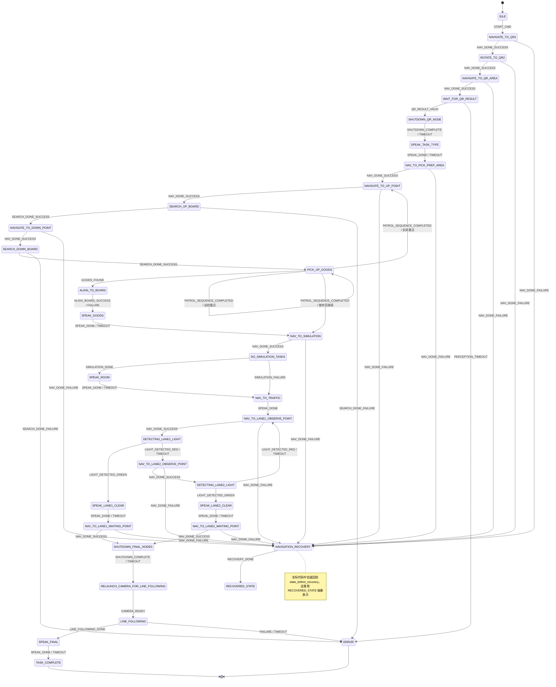

```mermaid
stateDiagram-v2
    %% @title 统一状态机主流程（按 all_guosai.py 提取）
    %% @note 为便于展示，省略部分内部动作、定时器与话题细节，保留主要状态与跳转关系

    [*] --> IDLE

    IDLE --> NAVIGATE_TO_QR1: START_CMD
    NAVIGATE_TO_QR1 --> ROTATE_TO_QR2: NAV_DONE_SUCCESS
    ROTATE_TO_QR2 --> NAVIGATE_TO_QR_AREA: NAV_DONE_SUCCESS
    NAVIGATE_TO_QR_AREA --> WAIT_FOR_QR_RESULT: NAV_DONE_SUCCESS
    WAIT_FOR_QR_RESULT --> SHUTDOWN_QR_NODE: QR_RESULT_VALID
    WAIT_FOR_QR_RESULT --> ERROR: PERCEPTION_TIMEOUT
    SHUTDOWN_QR_NODE --> SPEAK_TASK_TYPE: SHUTDOWN_COMPLETE / TIMEOUT
    SPEAK_TASK_TYPE --> NAV_TO_PICK_PREP_AREA: SPEAK_DONE / TIMEOUT

    NAV_TO_PICK_PREP_AREA --> NAVIGATE_TO_UP_POINT: NAV_DONE_SUCCESS
    NAVIGATE_TO_UP_POINT --> SEARCH_UP_BOARD: NAV_DONE_SUCCESS
    SEARCH_UP_BOARD --> NAVIGATE_TO_DOWN_POINT: SEARCH_DONE_SUCCESS
    SEARCH_UP_BOARD --> ERROR: SEARCH_DONE_FAILURE
    NAVIGATE_TO_DOWN_POINT --> SEARCH_DOWN_BOARD: NAV_DONE_SUCCESS
    SEARCH_DOWN_BOARD --> PICK_UP_GOODS: SEARCH_DONE_SUCCESS
    SEARCH_DOWN_BOARD --> ERROR: SEARCH_DONE_FAILURE

    PICK_UP_GOODS --> ALIGN_TO_BOARD: GOODS_FOUND
    PICK_UP_GOODS --> PICK_UP_GOODS: PATROL_SEQUENCE_COMPLETED / 巡检重试
    PICK_UP_GOODS --> NAVIGATE_TO_UP_POINT: PATROL_SEQUENCE_COMPLETED / 全局重试
    PICK_UP_GOODS --> NAV_TO_SIMULATION: PATROL_SEQUENCE_COMPLETED / 放弃后继续

    ALIGN_TO_BOARD --> SPEAK_GOODS: ALIGN_BOARD_SUCCESS / FAILURE
    SPEAK_GOODS --> NAV_TO_SIMULATION: SPEAK_DONE / TIMEOUT
    NAV_TO_SIMULATION --> DO_SIMULATION_TASKS: NAV_DONE_SUCCESS
    DO_SIMULATION_TASKS --> SPEAK_ROOM: SIMULATION_DONE
    DO_SIMULATION_TASKS --> NAV_TO_TRAFFIC: SIMULATION_FAILURE
    SPEAK_ROOM --> NAV_TO_TRAFFIC: SPEAK_DONE / TIMEOUT

    NAV_TO_TRAFFIC --> NAV_TO_LANE1_OBSERVE_POINT: SPEAK_DONE

    NAV_TO_LANE1_OBSERVE_POINT --> DETECTING_LANE1_LIGHT: NAV_DONE_SUCCESS
    DETECTING_LANE1_LIGHT --> SPEAK_LANE1_CLEAR: LIGHT_DETECTED_GREEN
    DETECTING_LANE1_LIGHT --> NAV_TO_LANE2_OBSERVE_POINT: LIGHT_DETECTED_RED / TIMEOUT
    SPEAK_LANE1_CLEAR --> NAV_TO_LANE1_WAITING_POINT: SPEAK_DONE / TIMEOUT
    NAV_TO_LANE1_WAITING_POINT --> SHUTDOWN_FINAL_NODES: NAV_DONE_SUCCESS

    NAV_TO_LANE2_OBSERVE_POINT --> DETECTING_LANE2_LIGHT: NAV_DONE_SUCCESS
    DETECTING_LANE2_LIGHT --> SPEAK_LANE2_CLEAR: LIGHT_DETECTED_GREEN
    DETECTING_LANE2_LIGHT --> NAV_TO_LANE1_OBSERVE_POINT: LIGHT_DETECTED_RED / TIMEOUT
    SPEAK_LANE2_CLEAR --> NAV_TO_LANE2_WAITING_POINT: SPEAK_DONE / TIMEOUT
    NAV_TO_LANE2_WAITING_POINT --> SHUTDOWN_FINAL_NODES: NAV_DONE_SUCCESS

    SHUTDOWN_FINAL_NODES --> RELAUNCH_CAMERA_FOR_LINE_FOLLOWING: SHUTDOWN_COMPLETE / TIMEOUT
    RELAUNCH_CAMERA_FOR_LINE_FOLLOWING --> LINE_FOLLOWING: CAMERA_READY
    LINE_FOLLOWING --> SPEAK_FINAL: LINE_FOLLOWING_DONE
    LINE_FOLLOWING --> ERROR: FAILURE / TIMEOUT
    SPEAK_FINAL --> TASK_COMPLETE: SPEAK_DONE / TIMEOUT
    TASK_COMPLETE --> [*]

    NAVIGATE_TO_QR1 --> NAVIGATION_RECOVERY: NAV_DONE_FAILURE
    ROTATE_TO_QR2 --> NAVIGATION_RECOVERY: NAV_DONE_FAILURE
    NAVIGATE_TO_QR_AREA --> NAVIGATION_RECOVERY: NAV_DONE_FAILURE
    NAV_TO_PICK_PREP_AREA --> NAVIGATION_RECOVERY: NAV_DONE_FAILURE
    NAVIGATE_TO_UP_POINT --> NAVIGATION_RECOVERY: NAV_DONE_FAILURE
    NAVIGATE_TO_DOWN_POINT --> NAVIGATION_RECOVERY: NAV_DONE_FAILURE
    NAV_TO_SIMULATION --> NAVIGATION_RECOVERY: NAV_DONE_FAILURE
    NAV_TO_LANE1_OBSERVE_POINT --> NAVIGATION_RECOVERY: NAV_DONE_FAILURE
    NAV_TO_LANE1_WAITING_POINT --> NAVIGATION_RECOVERY: NAV_DONE_FAILURE
    NAV_TO_LANE2_OBSERVE_POINT --> NAVIGATION_RECOVERY: NAV_DONE_FAILURE
    NAV_TO_LANE2_WAITING_POINT --> NAVIGATION_RECOVERY: NAV_DONE_FAILURE

    NAVIGATION_RECOVERY --> RECOVERED_STATE: RECOVERY_DONE
    note right of NAVIGATION_RECOVERY
      实际代码中会返回到 state_before_recovery，
      这里用 RECOVERED_STATE 抽象表示
    end note

    ERROR --> [*]
```
