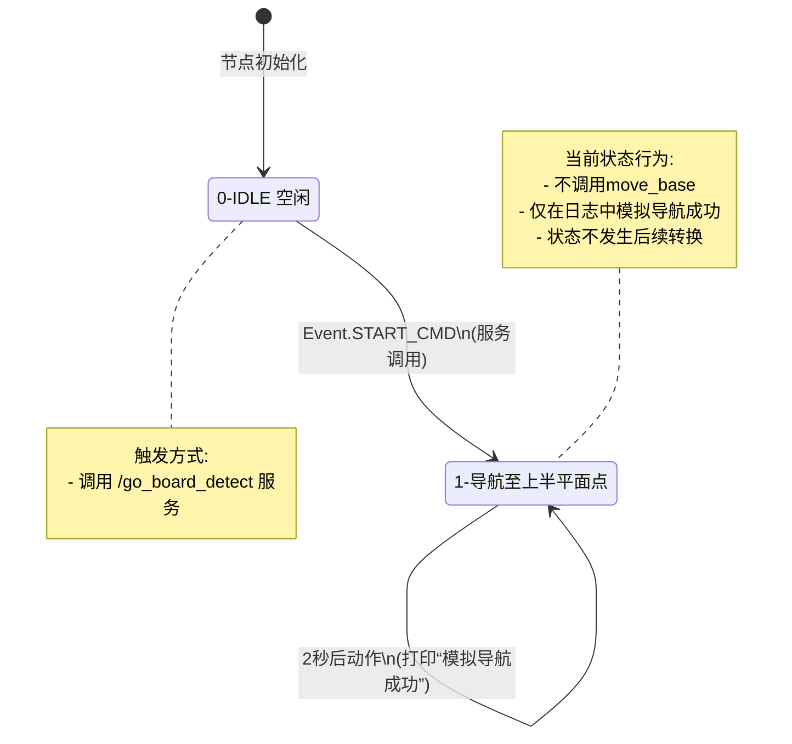

```mermaid
stateDiagram-v2
    %% 状态定义
    IDLE: 0-IDLE 空闲
    NAVIGATE_TO_UP_POINT: 1-导航至上半平面点
    
    %% 定义初始状态
    [*] --> IDLE: 节点初始化

    %% 状态转换
    IDLE --> NAVIGATE_TO_UP_POINT: Event.START_CMD\n(服务调用)

    NAVIGATE_TO_UP_POINT --> NAVIGATE_TO_UP_POINT: 2秒后动作\n(打印“模拟导航成功”)
    
    %% 启动流程说明
    note right of IDLE
        触发方式:
        - 调用 /go_board_detect 服务
    end note
    
    %% 导航状态说明
    note left of NAVIGATE_TO_UP_POINT
        当前状态行为:
        - 不调用move_base
        - 仅在日志中模拟导航成功
        - 状态不发生后续转换
    end note

```