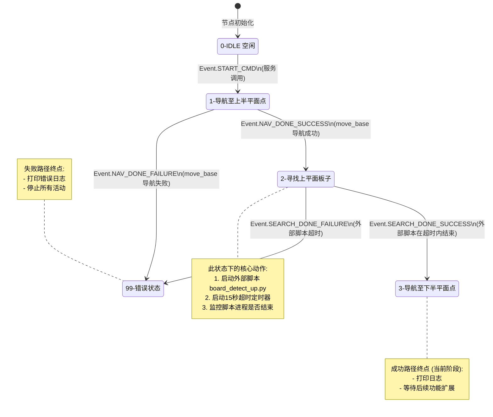

```mermaid
stateDiagram-v2
    %% 状态定义
    IDLE: 0-IDLE 空闲
    NAVIGATE_TO_UP_POINT: 1-导航至上半平面点
    SEARCH_UP_BOARD: 2-寻找上平面板子
    NAVIGATE_TO_DOWN_POINT: 3-导航至下半平面点
    ERROR: 99-错误状态

    %% 定义初始状态
    [*] --> IDLE: 节点初始化

    %% 状态转换
    IDLE --> NAVIGATE_TO_UP_POINT: Event.START_CMD\n(服务调用)

    NAVIGATE_TO_UP_POINT --> SEARCH_UP_BOARD: Event.NAV_DONE_SUCCESS\n(move_base 导航成功)
    NAVIGATE_TO_UP_POINT --> ERROR: Event.NAV_DONE_FAILURE\n(move_base 导航失败)

    SEARCH_UP_BOARD --> NAVIGATE_TO_DOWN_POINT: Event.SEARCH_DONE_SUCCESS\n(外部脚本在超时内结束)
    SEARCH_UP_BOARD --> ERROR: Event.SEARCH_DONE_FAILURE\n(外部脚本超时)

    %% 状态行为说明
    note right of SEARCH_UP_BOARD
        此状态下的核心动作:
        1. 启动外部脚本 board_detect_up.py
        2. 启动15秒超时定时器
        3. 监控脚本进程是否结束
    end note

    %% 流程终点说明
    note right of NAVIGATE_TO_DOWN_POINT
        成功路径终点 (当前阶段):
        - 打印日志
        - 等待后续功能扩展
    end note
    
    note left of ERROR
        失败路径终点:
        - 打印错误日志
        - 停止所有活动
    end note
```