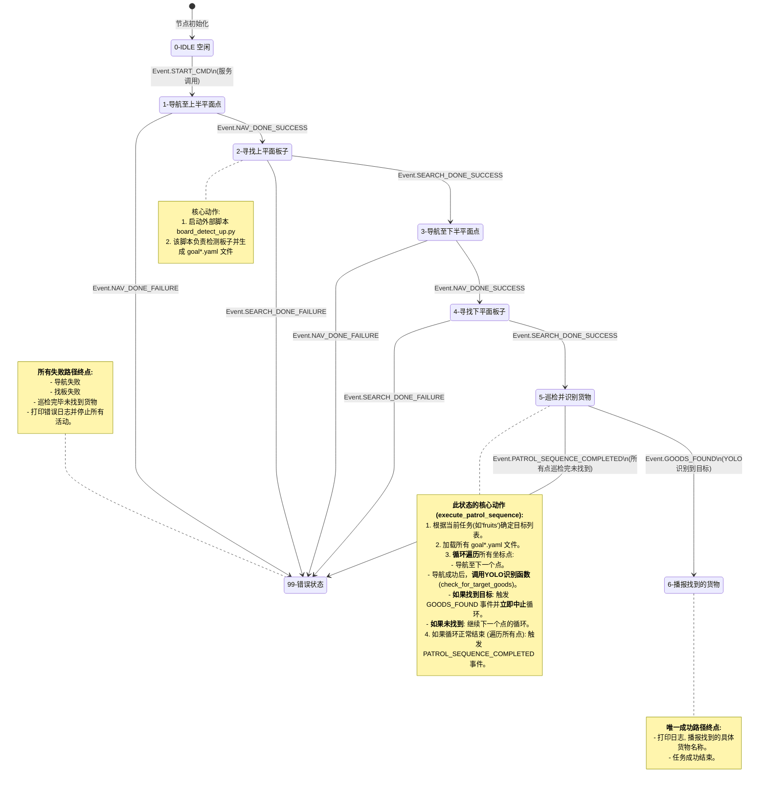

```mermaid
stateDiagram-v2
    %% 状态定义
    IDLE: 0-IDLE 空闲
    NAVIGATE_TO_UP_POINT: 1-导航至上半平面点
    SEARCH_UP_BOARD: 2-寻找上平面板子
    NAVIGATE_TO_DOWN_POINT: 3-导航至下半平面点
    SEARCH_DOWN_BOARD: 4-寻找下平面板子
    PICK_UP_GOODS: 5-巡检并识别货物
    SPEAK_GOODS: 6-播报找到的货物
    ERROR: 99-错误状态

    %% 定义初始状态
    [*] --> IDLE: 节点初始化

    %% 状态转换 (前期流程不变)
    IDLE --> NAVIGATE_TO_UP_POINT: Event.START_CMD\n(服务调用)

    NAVIGATE_TO_UP_POINT --> SEARCH_UP_BOARD: Event.NAV_DONE_SUCCESS
    NAVIGATE_TO_UP_POINT --> ERROR: Event.NAV_DONE_FAILURE

    SEARCH_UP_BOARD --> NAVIGATE_TO_DOWN_POINT: Event.SEARCH_DONE_SUCCESS
    SEARCH_UP_BOARD --> ERROR: Event.SEARCH_DONE_FAILURE

    NAVIGATE_TO_DOWN_POINT --> SEARCH_DOWN_BOARD: Event.NAV_DONE_SUCCESS
    NAVIGATE_TO_DOWN_POINT --> ERROR: Event.NAV_DONE_FAILURE

    SEARCH_DOWN_BOARD --> PICK_UP_GOODS: Event.SEARCH_DONE_SUCCESS
    SEARCH_DOWN_BOARD --> ERROR: Event.SEARCH_DONE_FAILURE

    %% 核心修改部分：新的状态转换
    PICK_UP_GOODS --> SPEAK_GOODS: Event.GOODS_FOUND\n(YOLO识别到目标)
    PICK_UP_GOODS --> ERROR: Event.PATROL_SEQUENCE_COMPLETED\n(所有点巡检完未找到)

    %% 状态行为说明
    note right of SEARCH_UP_BOARD
        核心动作:
        1. 启动外部脚本 board_detect_up.py
        2. 该脚本负责检测板子并生成 goal*.yaml 文件
    end note

    note right of PICK_UP_GOODS
        **此状态的核心动作 (execute_patrol_sequence):**
        1. 根据当前任务(如'fruits')确定目标列表。
        2. 加载所有 goal*.yaml 文件。
        3. **循环遍历**所有坐标点:
           - 导航至下一个点。
           - 导航成功后，**调用YOLO识别函数** (check_for_target_goods)。
           - **如果找到目标**: 触发 GOODS_FOUND 事件并**立即中止**循环。
           - **如果未找到**: 继续下一个点的循环。
        4. 如果循环正常结束 (遍历所有点): 触发 PATROL_SEQUENCE_COMPLETED 事件。
    end note

    note right of SPEAK_GOODS
        **唯一成功路径终点:**
        - 打印日志, 播报找到的具体货物名称。
        - 任务成功结束。
    end note
    
    note left of ERROR
        **所有失败路径终点:**
        - 导航失败
        - 找板失败
        - 巡检完毕未找到货物
        - 打印错误日志并停止所有活动。
    end note
```