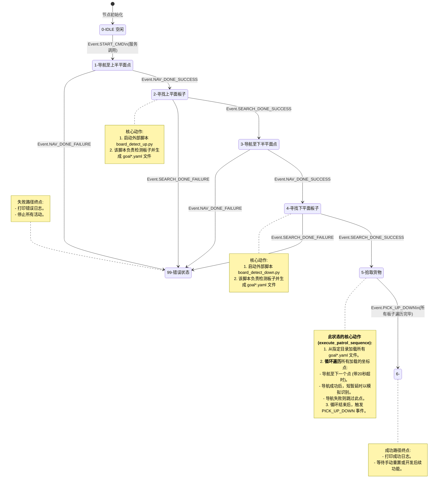

```mermaid
stateDiagram-v2
    %% 状态定义
    IDLE: 0-IDLE 空闲
    NAVIGATE_TO_UP_POINT: 1-导航至上半平面点
    SEARCH_UP_BOARD: 2-寻找上平面板子
    NAVIGATE_TO_DOWN_POINT: 3-导航至下半平面点
    SEARCH_DOWN_BOARD: 4-寻找下平面板子
    PICK_UP_GOODS: 5-拾取货物
    ANNOUNCE_GOODS: 6-
    ERROR: 99-错误状态

    %% 定义初始状态
    [*] --> IDLE: 节点初始化

    %% 状态转换
    IDLE --> NAVIGATE_TO_UP_POINT: Event.START_CMD\n(服务调用)

    NAVIGATE_TO_UP_POINT --> SEARCH_UP_BOARD: Event.NAV_DONE_SUCCESS
    NAVIGATE_TO_UP_POINT --> ERROR: Event.NAV_DONE_FAILURE

    SEARCH_UP_BOARD --> NAVIGATE_TO_DOWN_POINT: Event.SEARCH_DONE_SUCCESS
    SEARCH_UP_BOARD --> ERROR: Event.SEARCH_DONE_FAILURE

    NAVIGATE_TO_DOWN_POINT --> SEARCH_DOWN_BOARD: Event.NAV_DONE_SUCCESS
    NAVIGATE_TO_DOWN_POINT --> ERROR: Event.NAV_DONE_FAILURE

    SEARCH_DOWN_BOARD --> PICK_UP_GOODS: Event.SEARCH_DONE_SUCCESS
    SEARCH_DOWN_BOARD --> ERROR: Event.SEARCH_DONE_FAILURE

    PICK_UP_GOODS --> ANNOUNCE_GOODS: Event.PICK_UP_DOWN\n(所有板子遍历完毕)

    %% 状态行为说明
    note right of SEARCH_UP_BOARD
        核心动作:
        1. 启动外部脚本 board_detect_up.py
        2. 该脚本负责检测板子并生成 goal*.yaml 文件
    end note

    note right of SEARCH_DOWN_BOARD
        核心动作:
        1. 启动外部脚本 board_detect_down.py
        2. 该脚本负责检测板子并生成 goal*.yaml 文件
    end note

    note right of PICK_UP_GOODS
        **此状态的核心动作 (execute_patrol_sequence):**
        1. 从指定目录加载所有 goal*.yaml 文件。
        2. **循环遍历**所有加载的坐标点:
           - 导航至下一个点 (带20秒超时)。
           - 导航成功后，短暂延时以模拟识别。
           - 导航失败则跳过此点。
        3. 循环结束后，触发 PICK_UP_DOWN 事件。
    end note

    note right of ANNOUNCE_GOODS
        成功路径终点:
        - 打印成功日志。
        - 等待手动重置或开发后续功能。
    end note
    
    note left of ERROR
        失败路径终点:
        - 打印错误日志。
        - 停止所有活动。
    end note
```