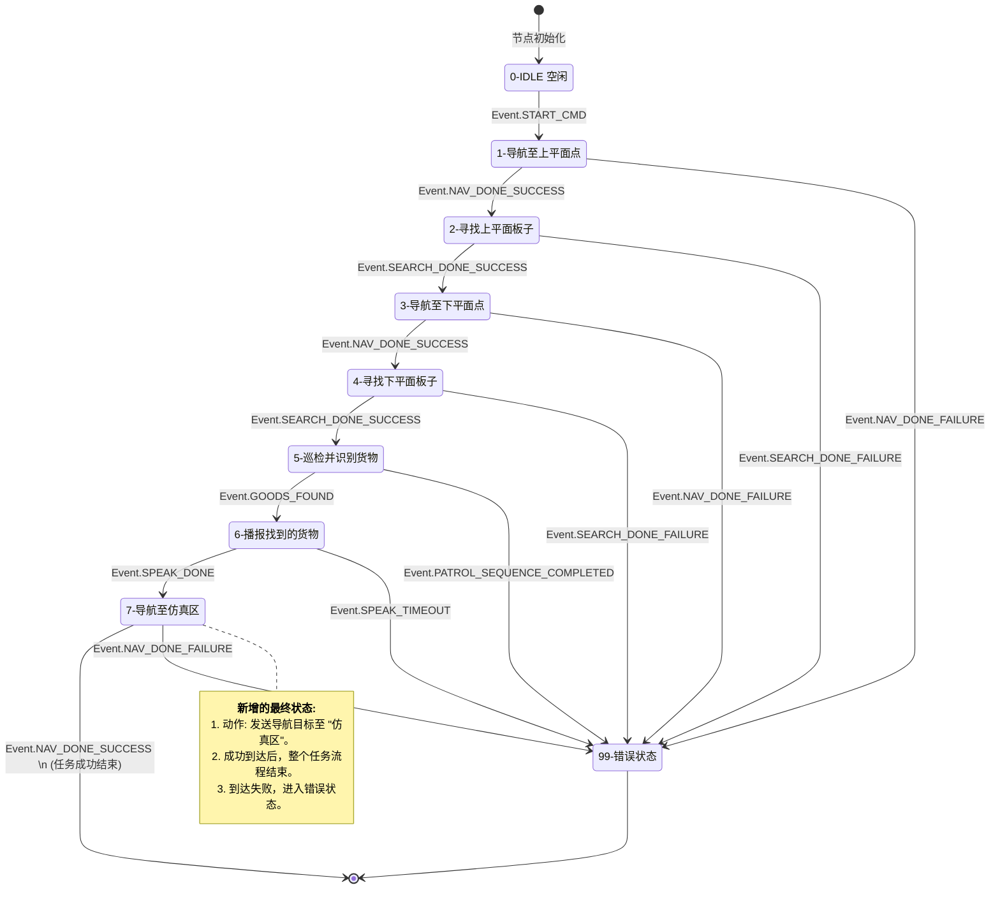

```mermaid
stateDiagram-v2
    %% 模式: 计划
    %% AI模型: Gemini
    %% 目的: 验证集成语音播报及最终导航步骤的逻辑流程

    %% --- 状态定义 ---
    IDLE: 0-IDLE 空闲
    NAVIGATE_TO_UP_POINT: 1-导航至上平面点
    SEARCH_UP_BOARD: 2-寻找上平面板子
    NAVIGATE_TO_DOWN_POINT: 3-导航至下平面点
    SEARCH_DOWN_BOARD: 4-寻找下平面板子
    PICK_UP_GOODS: 5-巡检并识别货物
    SPEAK_GOODS: 6-播报找到的货物
    NAV_TO_SIMULATION: 7-导航至仿真区
    ERROR: 99-错误状态

    %% --- 流程开始 ---
    [*] --> IDLE: 节点初始化

    %% --- 主要任务流程 ---
    IDLE --> NAVIGATE_TO_UP_POINT: Event.START_CMD

    NAVIGATE_TO_UP_POINT --> SEARCH_UP_BOARD: Event.NAV_DONE_SUCCESS
    NAVIGATE_TO_UP_POINT --> ERROR: Event.NAV_DONE_FAILURE

    SEARCH_UP_BOARD --> NAVIGATE_TO_DOWN_POINT: Event.SEARCH_DONE_SUCCESS
    SEARCH_UP_BOARD --> ERROR: Event.SEARCH_DONE_FAILURE

    NAVIGATE_TO_DOWN_POINT --> SEARCH_DOWN_BOARD: Event.NAV_DONE_SUCCESS
    NAVIGATE_TO_DOWN_POINT --> ERROR: Event.NAV_DONE_FAILURE

    SEARCH_DOWN_BOARD --> PICK_UP_GOODS: Event.SEARCH_DONE_SUCCESS
    SEARCH_DOWN_BOARD --> ERROR: Event.SEARCH_DONE_FAILURE

    PICK_UP_GOODS --> SPEAK_GOODS: Event.GOODS_FOUND
    PICK_UP_GOODS --> ERROR: Event.PATROL_SEQUENCE_COMPLETED

    %% --- 核心修改：语音播报后的新流程 ---
    SPEAK_GOODS --> NAV_TO_SIMULATION: Event.SPEAK_DONE
    SPEAK_GOODS --> ERROR: Event.SPEAK_TIMEOUT

    %% --- 新增的最终导航状态 ---
    NAV_TO_SIMULATION --> [*]: Event.NAV_DONE_SUCCESS \n (任务成功结束)
    NAV_TO_SIMULATION --> ERROR: Event.NAV_DONE_FAILURE

    %% --- 流程终点 ---
    ERROR --> [*]

    note right of NAV_TO_SIMULATION
        **新增的最终状态:**
        1. 动作: 发送导航目标至 "仿真区"。
        2. 成功到达后，整个任务流程结束。
        3. 到达失败，进入错误状态。
    end note
```