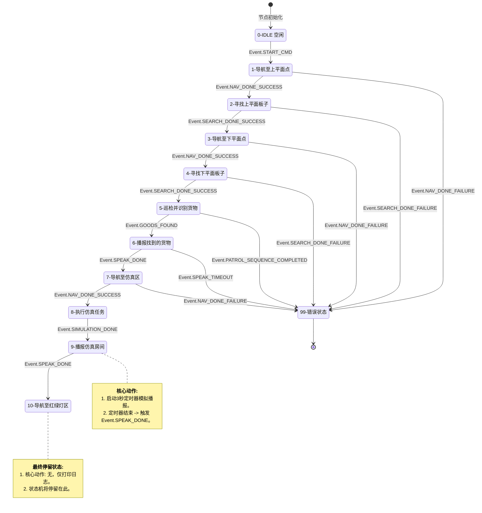

```mermaid
stateDiagram-v2
    %% 模式: 常规
    %% AI模型: Gemini
    %% 目的: 展示最终扩展完成后的状态机逻辑

    %% --- 状态定义 ---
    IDLE: 0-IDLE 空闲
    NAVIGATE_TO_UP_POINT: 1-导航至上平面点
    SEARCH_UP_BOARD: 2-寻找上平面板子
    NAVIGATE_TO_DOWN_POINT: 3-导航至下平面点
    SEARCH_DOWN_BOARD: 4-寻找下平面板子
    PICK_UP_GOODS: 5-巡检并识别货物
    SPEAK_GOODS: 6-播报找到的货物
    NAV_TO_SIMULATION: 7-导航至仿真区
    DO_SIMULATION_TASKS: 8-执行仿真任务
    SPEAK_ROOM: 9-播报仿真房间
    NAV_TO_TRAFFIC: 10-导航至红绿灯区
    ERROR: 99-错误状态

    %% --- 流程开始 ---
    [*] --> IDLE: 节点初始化

    %% --- 主要任务流程 ---
    IDLE --> NAVIGATE_TO_UP_POINT: Event.START_CMD
    NAVIGATE_TO_UP_POINT --> SEARCH_UP_BOARD: Event.NAV_DONE_SUCCESS
    NAVIGATE_TO_UP_POINT --> ERROR: Event.NAV_DONE_FAILURE
    SEARCH_UP_BOARD --> NAVIGATE_TO_DOWN_POINT: Event.SEARCH_DONE_SUCCESS
    SEARCH_UP_BOARD --> ERROR: Event.SEARCH_DONE_FAILURE
    NAVIGATE_TO_DOWN_POINT --> SEARCH_DOWN_BOARD: Event.NAV_DONE_SUCCESS
    NAVIGATE_TO_DOWN_POINT --> ERROR: Event.NAV_DONE_FAILURE
    SEARCH_DOWN_BOARD --> PICK_UP_GOODS: Event.SEARCH_DONE_SUCCESS
    SEARCH_DOWN_BOARD --> ERROR: Event.SEARCH_DONE_FAILURE
    PICK_UP_GOODS --> SPEAK_GOODS: Event.GOODS_FOUND
    PICK_UP_GOODS --> ERROR: Event.PATROL_SEQUENCE_COMPLETED
    SPEAK_GOODS --> NAV_TO_SIMULATION: Event.SPEAK_DONE
    SPEAK_GOODS --> ERROR: Event.SPEAK_TIMEOUT
    NAV_TO_SIMULATION --> DO_SIMULATION_TASKS: Event.NAV_DONE_SUCCESS
    NAV_TO_SIMULATION --> ERROR: Event.NAV_DONE_FAILURE
    DO_SIMULATION_TASKS --> SPEAK_ROOM: Event.SIMULATION_DONE
    SPEAK_ROOM --> NAV_TO_TRAFFIC: Event.SPEAK_DONE

    %% --- 流程终点 ---
    ERROR --> [*]


    note right of SPEAK_ROOM
        **核心动作:**
        1. 启动3秒定时器模拟播报。
        2. 定时器结束 -> 触发 Event.SPEAK_DONE。
    end note

    note right of NAV_TO_TRAFFIC
        **最终停留状态:**
        1. 核心动作: 无，仅打印日志。
        2. 状态机将停留在此。
    end note
```