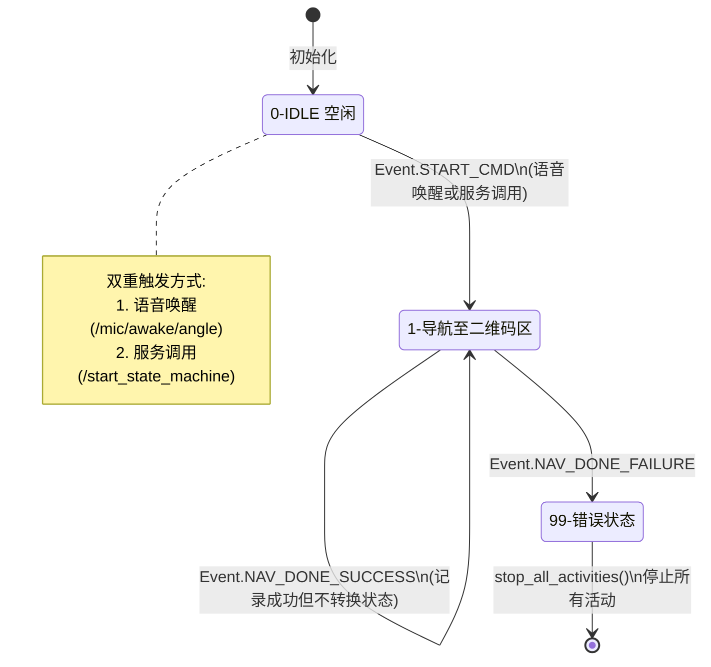

```mermaid
stateDiagram-v2
    %% 状态定义
    IDLE: 0-IDLE 空闲
    NAVIGATE_TO_QR: 1-导航至二维码区
    ERROR: 99-错误状态
    
    %% 定义初始状态
    [*] --> IDLE: 初始化
    
    %% 状态转换
    IDLE --> NAVIGATE_TO_QR: Event.START_CMD\n(语音唤醒或服务调用)
    
    NAVIGATE_TO_QR --> NAVIGATE_TO_QR: Event.NAV_DONE_SUCCESS\n(记录成功但不转换状态)
    NAVIGATE_TO_QR --> ERROR: Event.NAV_DONE_FAILURE
    
    %% 错误状态处理
    ERROR --> [*]: stop_all_activities()\n停止所有活动
    
 
    
    
    %% 启动流程说明
    note right of IDLE
        双重触发方式:
        1. 语音唤醒(/mic/awake/angle)
        2. 服务调用(/start_state_machine)
    end note
```