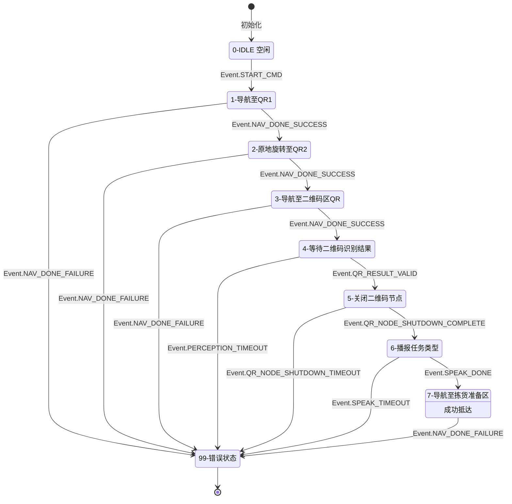

```mermaid
stateDiagram-v2
    %% @title 前半段状态机流程 (最终版-包含超时保护)
    
    %% --- 状态定义 ---
    IDLE: 0-IDLE 空闲
    NAVIGATE_TO_QR1: 1-导航至QR1
    ROTATE_TO_QR2: 2-原地旋转至QR2
    NAVIGATE_TO_QR_AREA: 3-导航至二维码区QR
    WAIT_FOR_QR_RESULT: 4-等待二维码识别结果
    SHUTDOWN_QR_NODE: 5-关闭二维码节点
    SPEAK_TASK_TYPE: 6-播报任务类型
    NAV_TO_PICK_PREP_AREA: 7-导航至拣货准备区
    ERROR: 99-错误状态

    %% --- 定义初始状态 ---
    [*] --> IDLE: 初始化

    %% --- 主要状态转换流程 ---
    IDLE --> NAVIGATE_TO_QR1: Event.START_CMD
    NAVIGATE_TO_QR1 --> ROTATE_TO_QR2: Event.NAV_DONE_SUCCESS
    ROTATE_TO_QR2 --> NAVIGATE_TO_QR_AREA: Event.NAV_DONE_SUCCESS
    NAVIGATE_TO_QR_AREA --> WAIT_FOR_QR_RESULT: Event.NAV_DONE_SUCCESS
    WAIT_FOR_QR_RESULT --> SHUTDOWN_QR_NODE: Event.QR_RESULT_VALID
    SHUTDOWN_QR_NODE --> SPEAK_TASK_TYPE: Event.QR_NODE_SHUTDOWN_COMPLETE
    SPEAK_TASK_TYPE --> NAV_TO_PICK_PREP_AREA: Event.SPEAK_DONE
    
    NAV_TO_PICK_PREP_AREA: 成功抵达

    %% --- 错误处理转换 ---
    NAVIGATE_TO_QR1 --> ERROR: Event.NAV_DONE_FAILURE
    ROTATE_TO_QR2 --> ERROR: Event.NAV_DONE_FAILURE
    NAVIGATE_TO_QR_AREA --> ERROR: Event.NAV_DONE_FAILURE
    WAIT_FOR_QR_RESULT --> ERROR: Event.PERCEPTION_TIMEOUT
    
    %% -- 关键更新点：明确指出超时事件 --
    SHUTDOWN_QR_NODE --> ERROR: Event.QR_NODE_SHUTDOWN_TIMEOUT
    
    SPEAK_TASK_TYPE --> ERROR: Event.SPEAK_TIMEOUT
    NAV_TO_PICK_PREP_AREA --> ERROR: Event.NAV_DONE_FAILURE
    
    %% --- 错误状态处理 ---
    ERROR --> [*]
```