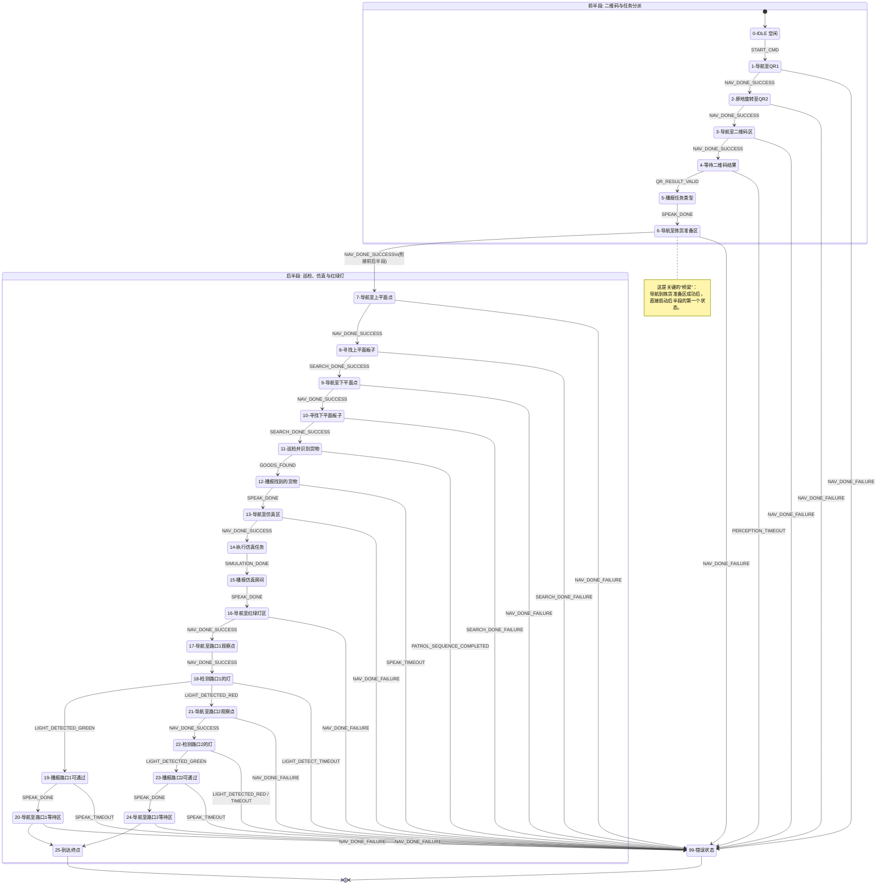

```mermaid
stateDiagram-v2
    %% @title 统一后的机器人完整任务状态图
    %% @author Gemini (根据用户需求合并)

    %% --- 状态定义 ---
    state "前半段: 二维码与任务分派" as Phase1 {
        direction LR
        [*] --> IDLE
        IDLE: 0-IDLE 空闲
        NAVIGATE_TO_QR1: 1-导航至QR1
        ROTATE_TO_QR2: 2-原地旋转至QR2
        NAVIGATE_TO_QR_AREA: 3-导航至二维码区
        WAIT_FOR_QR_RESULT: 4-等待二维码结果
        SPEAK_TASK_TYPE: 5-播报任务类型
        NAV_TO_PICK_PREP_AREA: 6-导航至拣货准备区
        IDLE --> NAVIGATE_TO_QR1: START_CMD
        NAVIGATE_TO_QR1 --> ROTATE_TO_QR2: NAV_DONE_SUCCESS
        ROTATE_TO_QR2 --> NAVIGATE_TO_QR_AREA: NAV_DONE_SUCCESS
        NAVIGATE_TO_QR_AREA --> WAIT_FOR_QR_RESULT: NAV_DONE_SUCCESS
        WAIT_FOR_QR_RESULT --> SPEAK_TASK_TYPE: QR_RESULT_VALID
        SPEAK_TASK_TYPE --> NAV_TO_PICK_PREP_AREA: SPEAK_DONE
    }

    state "后半段: 巡检、仿真与红绿灯" as Phase2 {
        direction LR
        NAVIGATE_TO_UP_POINT: 7-导航至上平面点
        SEARCH_UP_BOARD: 8-寻找上平面板子
        NAVIGATE_TO_DOWN_POINT: 9-导航至下平面点
        SEARCH_DOWN_BOARD: 10-寻找下平面板子
        PICK_UP_GOODS: 11-巡检并识别货物
        SPEAK_GOODS: 12-播报找到的货物
        NAV_TO_SIMULATION: 13-导航至仿真区
        DO_SIMULATION_TASKS: 14-执行仿真任务
        SPEAK_ROOM: 15-播报仿真房间
        NAV_TO_TRAFFIC: 16-导航至红绿灯区
        NAV_TO_LANE1_OBSERVE_POINT: 17-导航至路口1观察点
        DETECTING_LANE1_LIGHT: 18-检测路口1的灯
        SPEAK_LANE1_CLEAR: 19-播报路口1可通过
        NAV_TO_LANE1_WAITING_POINT: 20-导航至路口1等待区
        NAV_TO_LANE2_OBSERVE_POINT: 21-导航至路口2观察点
        DETECTING_LANE2_LIGHT: 22-检测路口2的灯
        SPEAK_LANE2_CLEAR: 23-播报路口2可通过
        NAV_TO_LANE2_WAITING_POINT: 24-导航至路口2等待区
        FINAL_HOLD: 25-到达终点

        NAVIGATE_TO_UP_POINT --> SEARCH_UP_BOARD: NAV_DONE_SUCCESS
        SEARCH_UP_BOARD --> NAVIGATE_TO_DOWN_POINT: SEARCH_DONE_SUCCESS
        NAVIGATE_TO_DOWN_POINT --> SEARCH_DOWN_BOARD: NAV_DONE_SUCCESS
        SEARCH_DOWN_BOARD --> PICK_UP_GOODS: SEARCH_DONE_SUCCESS
        PICK_UP_GOODS --> SPEAK_GOODS: GOODS_FOUND
        SPEAK_GOODS --> NAV_TO_SIMULATION: SPEAK_DONE
        NAV_TO_SIMULATION --> DO_SIMULATION_TASKS: NAV_DONE_SUCCESS
        DO_SIMULATION_TASKS --> SPEAK_ROOM: SIMULATION_DONE
        SPEAK_ROOM --> NAV_TO_TRAFFIC: SPEAK_DONE
        NAV_TO_TRAFFIC --> NAV_TO_LANE1_OBSERVE_POINT: NAV_DONE_SUCCESS
        NAV_TO_LANE1_OBSERVE_POINT --> DETECTING_LANE1_LIGHT: NAV_DONE_SUCCESS
        DETECTING_LANE1_LIGHT --> SPEAK_LANE1_CLEAR: LIGHT_DETECTED_GREEN
        DETECTING_LANE1_LIGHT --> NAV_TO_LANE2_OBSERVE_POINT: LIGHT_DETECTED_RED
        SPEAK_LANE1_CLEAR --> NAV_TO_LANE1_WAITING_POINT: SPEAK_DONE
        NAV_TO_LANE1_WAITING_POINT --> FINAL_HOLD
        NAV_TO_LANE2_OBSERVE_POINT --> DETECTING_LANE2_LIGHT: NAV_DONE_SUCCESS
        DETECTING_LANE2_LIGHT --> SPEAK_LANE2_CLEAR: LIGHT_DETECTED_GREEN
        SPEAK_LANE2_CLEAR --> NAV_TO_LANE2_WAITING_POINT: SPEAK_DONE
        NAV_TO_LANE2_WAITING_POINT --> FINAL_HOLD
    }

    %% --- 状态衔接的关键桥梁 ---
    NAV_TO_PICK_PREP_AREA --> NAVIGATE_TO_UP_POINT: NAV_DONE_SUCCESS\n(衔接前后半段)
    note right of NAV_TO_PICK_PREP_AREA
        这是关键的“桥梁”：
        导航到拣货准备区成功后，
        直接启动后半段的第一个状态。
    end note

    %% --- 统一的错误处理流程 ---
    ERROR: 99-错误状态
    NAVIGATE_TO_QR1 --> ERROR: NAV_DONE_FAILURE
    ROTATE_TO_QR2 --> ERROR: NAV_DONE_FAILURE
    NAVIGATE_TO_QR_AREA --> ERROR: NAV_DONE_FAILURE
    WAIT_FOR_QR_RESULT --> ERROR: PERCEPTION_TIMEOUT
    NAV_TO_PICK_PREP_AREA --> ERROR: NAV_DONE_FAILURE
    NAVIGATE_TO_UP_POINT --> ERROR: NAV_DONE_FAILURE
    SEARCH_UP_BOARD --> ERROR: SEARCH_DONE_FAILURE
    NAVIGATE_TO_DOWN_POINT --> ERROR: NAV_DONE_FAILURE
    SEARCH_DOWN_BOARD --> ERROR: SEARCH_DONE_FAILURE
    PICK_UP_GOODS --> ERROR: PATROL_SEQUENCE_COMPLETED
    SPEAK_GOODS --> ERROR: SPEAK_TIMEOUT
    NAV_TO_SIMULATION --> ERROR: NAV_DONE_FAILURE
    NAV_TO_TRAFFIC --> ERROR: NAV_DONE_FAILURE
    DETECTING_LANE1_LIGHT --> ERROR: LIGHT_DETECT_TIMEOUT
    SPEAK_LANE1_CLEAR --> ERROR: SPEAK_TIMEOUT
    NAV_TO_LANE1_WAITING_POINT --> ERROR: NAV_DONE_FAILURE
    NAV_TO_LANE2_OBSERVE_POINT --> ERROR: NAV_DONE_FAILURE
    DETECTING_LANE2_LIGHT --> ERROR: LIGHT_DETECTED_RED / TIMEOUT
    SPEAK_LANE2_CLEAR --> ERROR: SPEAK_TIMEOUT
    NAV_TO_LANE2_WAITING_POINT --> ERROR: NAV_DONE_FAILURE

    %% --- 流程终点 ---
    FINAL_HOLD --> [*]
    ERROR --> [*]
    
```