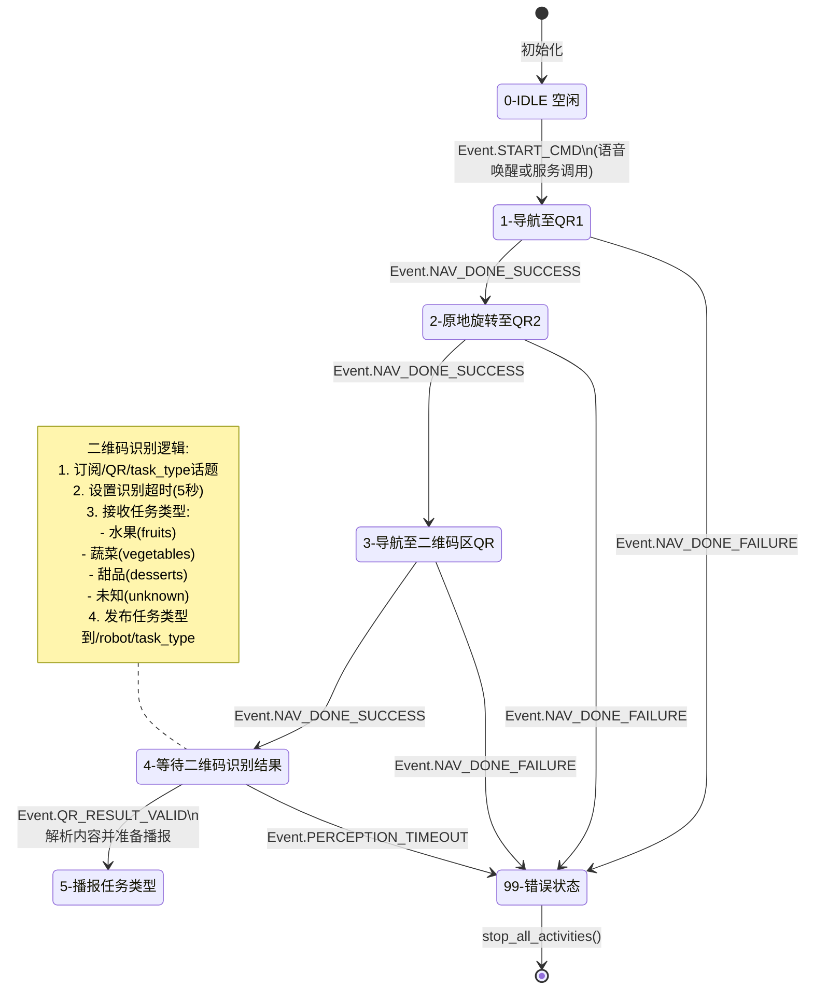

```mermaid
stateDiagram-v2
    %% 状态定义
    IDLE: 0-IDLE 空闲
    NAVIGATE_TO_QR1: 1-导航至QR1
    ROTATE_TO_QR2: 2-原地旋转至QR2
    NAVIGATE_TO_QR_AREA: 3-导航至二维码区QR
    WAIT_FOR_QR_RESULT: 4-等待二维码识别结果
    SPEAK_TASK_TYPE: 5-播报任务类型
    ERROR: 99-错误状态
    
    %% 定义初始状态
    [*] --> IDLE: 初始化
    
    %% 主要状态转换流程
    IDLE --> NAVIGATE_TO_QR1: Event.START_CMD\n(语音唤醒或服务调用)
    NAVIGATE_TO_QR1 --> ROTATE_TO_QR2: Event.NAV_DONE_SUCCESS
    ROTATE_TO_QR2 --> NAVIGATE_TO_QR_AREA: Event.NAV_DONE_SUCCESS
    NAVIGATE_TO_QR_AREA --> WAIT_FOR_QR_RESULT: Event.NAV_DONE_SUCCESS
    
    %% 错误处理转换
    NAVIGATE_TO_QR1 --> ERROR: Event.NAV_DONE_FAILURE
    ROTATE_TO_QR2 --> ERROR: Event.NAV_DONE_FAILURE
    NAVIGATE_TO_QR_AREA --> ERROR: Event.NAV_DONE_FAILURE
    WAIT_FOR_QR_RESULT --> ERROR: Event.PERCEPTION_TIMEOUT
    
    %% 二维码结果处理和语音播报
    WAIT_FOR_QR_RESULT --> SPEAK_TASK_TYPE: Event.QR_RESULT_VALID\n解析内容并准备播报
    
    %% 错误状态处理
    ERROR --> [*]: stop_all_activities()
    
    
    %% 二维码识别说明
    note left of WAIT_FOR_QR_RESULT
        二维码识别逻辑:
        1. 订阅/QR/task_type话题
        2. 设置识别超时(5秒)
        3. 接收任务类型:
           - 水果(fruits)
           - 蔬菜(vegetables)
           - 甜品(desserts)
           - 未知(unknown)
        4. 发布任务类型到/robot/task_type
    end note

```