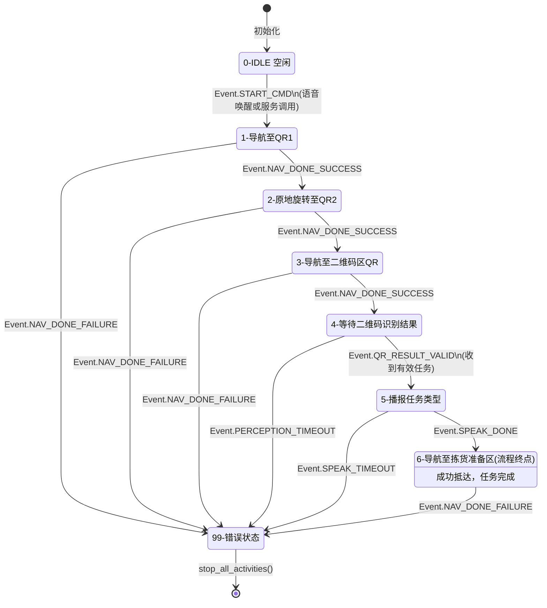

```mermaid
stateDiagram-v2
    %% 状态定义
    IDLE: 0-IDLE 空闲
    NAVIGATE_TO_QR1: 1-导航至QR1
    ROTATE_TO_QR2: 2-原地旋转至QR2
    NAVIGATE_TO_QR_AREA: 3-导航至二维码区QR
    WAIT_FOR_QR_RESULT: 4-等待二维码识别结果
    SPEAK_TASK_TYPE: 5-播报任务类型
    NAV_TO_PICK_PREP_AREA: 6-导航至拣货准备区(流程终点)
    ERROR: 99-错误状态

    %% 定义初始状态
    [*] --> IDLE: 初始化

    %% 主要状态转换流程
    IDLE --> NAVIGATE_TO_QR1: Event.START_CMD\n(语音唤醒或服务调用)
    NAVIGATE_TO_QR1 --> ROTATE_TO_QR2: Event.NAV_DONE_SUCCESS
    ROTATE_TO_QR2 --> NAVIGATE_TO_QR_AREA: Event.NAV_DONE_SUCCESS
    NAVIGATE_TO_QR_AREA --> WAIT_FOR_QR_RESULT: Event.NAV_DONE_SUCCESS
    WAIT_FOR_QR_RESULT --> SPEAK_TASK_TYPE: Event.QR_RESULT_VALID\n(收到有效任务)
    SPEAK_TASK_TYPE --> NAV_TO_PICK_PREP_AREA: Event.SPEAK_DONE
    
    %% 成功到达终点后，流程结束，停留在当前状态
    NAV_TO_PICK_PREP_AREA: 成功抵达，任务完成

    %% 错误处理转换
    NAVIGATE_TO_QR1 --> ERROR: Event.NAV_DONE_FAILURE
    ROTATE_TO_QR2 --> ERROR: Event.NAV_DONE_FAILURE
    NAVIGATE_TO_QR_AREA --> ERROR: Event.NAV_DONE_FAILURE
    WAIT_FOR_QR_RESULT --> ERROR: Event.PERCEPTION_TIMEOUT
    SPEAK_TASK_TYPE --> ERROR: Event.SPEAK_TIMEOUT
    NAV_TO_PICK_PREP_AREA --> ERROR: Event.NAV_DONE_FAILURE
    
    %% 错误状态处理
    ERROR --> [*]: stop_all_activities()
    
```