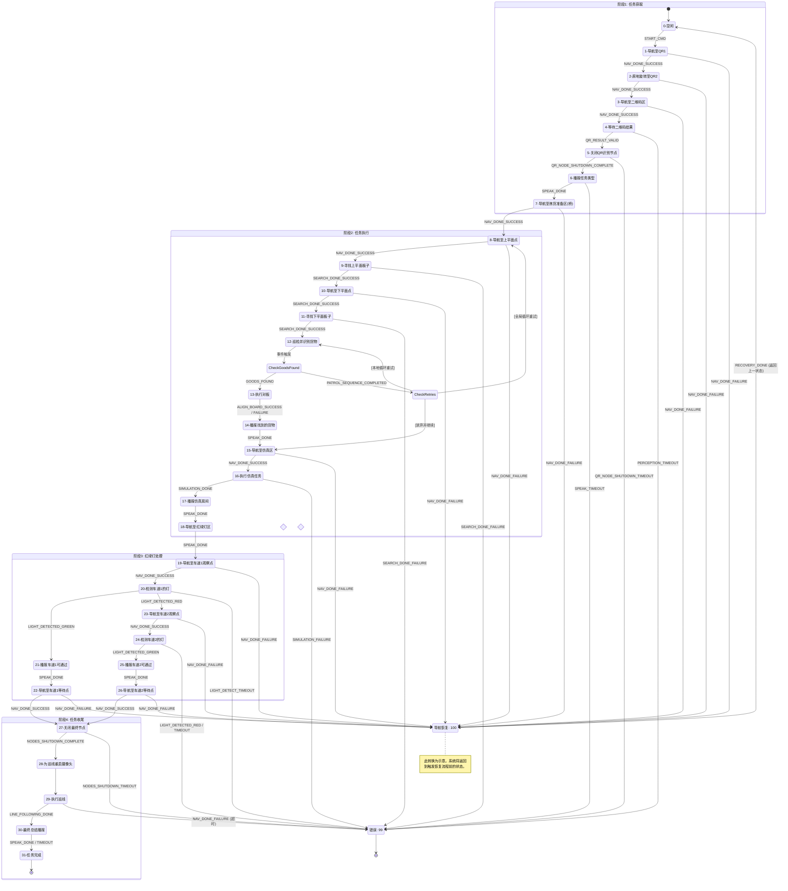

```mermaid
stateDiagram-v2
    %% @title 统一状态机完整任务流程 (与 all.py 代码同步)
    %% @author Gemini (根据 all.py 修正)
    %% @version 2.1 (中文注释版)

    %% --- 阶段1: 任务获取 ---
    state "阶段1: 任务获取" as Phase1 {
        direction LR
        [*] --> IDLE
        IDLE: 0-空闲
        NAVIGATE_TO_QR1: 1-导航至QR1
        ROTATE_TO_QR2: 2-原地旋转至QR2
        NAVIGATE_TO_QR_AREA: 3-导航至二维码区
        WAIT_FOR_QR_RESULT: 4-等待二维码结果
        SHUTDOWN_QR_NODE: 5-关闭QR识别节点
        SPEAK_TASK_TYPE: 6-播报任务类型
        NAV_TO_PICK_PREP_AREA: 7-导航至拣货准备区(桥)

        IDLE --> NAVIGATE_TO_QR1: START_CMD
        NAVIGATE_TO_QR1 --> ROTATE_TO_QR2: NAV_DONE_SUCCESS
        ROTATE_TO_QR2 --> NAVIGATE_TO_QR_AREA: NAV_DONE_SUCCESS
        NAVIGATE_TO_QR_AREA --> WAIT_FOR_QR_RESULT: NAV_DONE_SUCCESS
        WAIT_FOR_QR_RESULT --> SHUTDOWN_QR_NODE: QR_RESULT_VALID
        SHUTDOWN_QR_NODE --> SPEAK_TASK_TYPE: QR_NODE_SHUTDOWN_COMPLETE
        SPEAK_TASK_TYPE --> NAV_TO_PICK_PREP_AREA: SPEAK_DONE
    }

    %% --- 阶段2: 任务执行 ---
    state "阶段2: 任务执行" as Phase2 {
        direction LR
        NAVIGATE_TO_UP_POINT: 8-导航至上平面点
        SEARCH_UP_BOARD: 9-寻找上平面板子
        NAVIGATE_TO_DOWN_POINT: 10-导航至下平面点
        SEARCH_DOWN_BOARD: 11-寻找下平面板子
        PICK_UP_GOODS: 12-巡检并识别货物
        ALIGN_TO_BOARD: 13-执行对板
        SPEAK_GOODS: 14-播报找到的货物
        NAV_TO_SIMULATION: 15-导航至仿真区
        DO_SIMULATION_TASKS: 16-执行仿真任务
        SPEAK_ROOM: 17-播报仿真房间
        NAV_TO_TRAFFIC: 18-导航至红绿灯区

        NAVIGATE_TO_UP_POINT --> SEARCH_UP_BOARD: NAV_DONE_SUCCESS
        SEARCH_UP_BOARD --> NAVIGATE_TO_DOWN_POINT: SEARCH_DONE_SUCCESS
        NAVIGATE_TO_DOWN_POINT --> SEARCH_DOWN_BOARD: SEARCH_DONE_SUCCESS
        SEARCH_DOWN_BOARD --> PICK_UP_GOODS: SEARCH_DONE_SUCCESS
        
        state "找到货物?" as CheckGoodsFound <<choice>>
        PICK_UP_GOODS --> CheckGoodsFound: 事件触发
        CheckGoodsFound --> ALIGN_TO_BOARD: GOODS_FOUND
        
        state "巡检失败?" as CheckRetries <<choice>>
        CheckGoodsFound --> CheckRetries: PATROL_SEQUENCE_COMPLETED
        CheckRetries --> PICK_UP_GOODS: [本地循环重试]
        CheckRetries --> NAVIGATE_TO_UP_POINT: [全局循环重试]
        CheckRetries --> NAV_TO_SIMULATION: [放弃并继续]
        
        ALIGN_TO_BOARD --> SPEAK_GOODS: ALIGN_BOARD_SUCCESS / FAILURE
        SPEAK_GOODS --> NAV_TO_SIMULATION: SPEAK_DONE
        NAV_TO_SIMULATION --> DO_SIMULATION_TASKS: NAV_DONE_SUCCESS
        DO_SIMULATION_TASKS --> SPEAK_ROOM: SIMULATION_DONE
        SPEAK_ROOM --> NAV_TO_TRAFFIC: SPEAK_DONE
    }

    %% --- 阶段3: 红绿灯处理 ---
    state "阶段3: 红绿灯处理" as Phase3 {
        direction LR
        NAV_TO_LANE1_OBSERVE_POINT: 19-导航至车道1观察点
        DETECTING_LANE1_LIGHT: 20-检测车道1的灯
        SPEAK_LANE1_CLEAR: 21-播报车道1可通过
        NAV_TO_LANE1_WAITING_POINT: 22-导航至车道1等待点
        NAV_TO_LANE2_OBSERVE_POINT: 23-导航至车道2观察点
        DETECTING_LANE2_LIGHT: 24-检测车道2的灯
        SPEAK_LANE2_CLEAR: 25-播报车道2可通过
        NAV_TO_LANE2_WAITING_POINT: 26-导航至车道2等待点

        NAV_TO_LANE1_OBSERVE_POINT --> DETECTING_LANE1_LIGHT: NAV_DONE_SUCCESS
        DETECTING_LANE1_LIGHT --> SPEAK_LANE1_CLEAR: LIGHT_DETECTED_GREEN
        DETECTING_LANE1_LIGHT --> NAV_TO_LANE2_OBSERVE_POINT: LIGHT_DETECTED_RED
        SPEAK_LANE1_CLEAR --> NAV_TO_LANE1_WAITING_POINT: SPEAK_DONE
        
        NAV_TO_LANE2_OBSERVE_POINT --> DETECTING_LANE2_LIGHT: NAV_DONE_SUCCESS
        DETECTING_LANE2_LIGHT --> SPEAK_LANE2_CLEAR: LIGHT_DETECTED_GREEN
        SPEAK_LANE2_CLEAR --> NAV_TO_LANE2_WAITING_POINT: SPEAK_DONE
    }

    %% --- 阶段4: 任务收尾 ---
    state "阶段4: 任务收尾" as Phase4 {
        direction LR
        SHUTDOWN_FINAL_NODES: 27-关闭最终节点
        RELAUNCH_CAMERA_FOR_LINE_FOLLOWING: 28-为巡线重启摄像头
        LINE_FOLLOWING: 29-执行巡线
        SPEAK_FINAL: 30-最终总结播报
        TASK_COMPLETE: 31-任务完成
        
        SHUTDOWN_FINAL_NODES --> RELAUNCH_CAMERA_FOR_LINE_FOLLOWING: NODES_SHUTDOWN_COMPLETE
        RELAUNCH_CAMERA_FOR_LINE_FOLLOWING --> LINE_FOLLOWING
        LINE_FOLLOWING --> SPEAK_FINAL: LINE_FOLLOWING_DONE
        SPEAK_FINAL --> TASK_COMPLETE: SPEAK_DONE / TIMEOUT
        TASK_COMPLETE --> [*]
    }
    
    %% --- 阶段间转换 ---
    NAV_TO_PICK_PREP_AREA --> NAVIGATE_TO_UP_POINT: NAV_DONE_SUCCESS
    NAV_TO_TRAFFIC --> NAV_TO_LANE1_OBSERVE_POINT: SPEAK_DONE
    NAV_TO_LANE1_WAITING_POINT --> SHUTDOWN_FINAL_NODES: NAV_DONE_SUCCESS
    NAV_TO_LANE2_WAITING_POINT --> SHUTDOWN_FINAL_NODES: NAV_DONE_SUCCESS

    %% --- 系统状态 (错误与恢复) ---
    state "导航恢复: 100" as NAVIGATION_RECOVERY
    state "错误: 99" as ERROR
    ERROR --> [*]

    %% --- 导航失败事件将触发恢复流程 ---
    NAVIGATE_TO_QR1 --> NAVIGATION_RECOVERY: NAV_DONE_FAILURE
    ROTATE_TO_QR2 --> NAVIGATION_RECOVERY: NAV_DONE_FAILURE
    NAVIGATE_TO_QR_AREA --> NAVIGATION_RECOVERY: NAV_DONE_FAILURE
    NAV_TO_PICK_PREP_AREA --> NAVIGATION_RECOVERY: NAV_DONE_FAILURE
    NAVIGATE_TO_UP_POINT --> NAVIGATION_RECOVERY: NAV_DONE_FAILURE
    NAVIGATE_TO_DOWN_POINT --> NAVIGATION_RECOVERY: NAV_DONE_FAILURE
    NAV_TO_SIMULATION --> NAVIGATION_RECOVERY: NAV_DONE_FAILURE
    NAV_TO_LANE1_OBSERVE_POINT --> NAVIGATION_RECOVERY: NAV_DONE_FAILURE
    NAV_TO_LANE1_WAITING_POINT --> NAVIGATION_RECOVERY: NAV_DONE_FAILURE
    NAV_TO_LANE2_OBSERVE_POINT --> NAVIGATION_RECOVERY: NAV_DONE_FAILURE
    NAV_TO_LANE2_WAITING_POINT --> NAVIGATION_RECOVERY: NAV_DONE_FAILURE
    
    %% 恢复成功后，返回到失败前的状态
    NAVIGATION_RECOVERY --> IDLE: RECOVERY_DONE (返回上一状态)
    note right of NAVIGATION_RECOVERY: 此转换为示意。系统将返回到触发恢复流程前的状态。

    %% --- 其他失败事件将直接导致错误 ---
    WAIT_FOR_QR_RESULT --> ERROR: PERCEPTION_TIMEOUT
    SHUTDOWN_QR_NODE --> ERROR: QR_NODE_SHUTDOWN_TIMEOUT
    SPEAK_TASK_TYPE --> ERROR: SPEAK_TIMEOUT
    SEARCH_UP_BOARD --> ERROR: SEARCH_DONE_FAILURE
    SEARCH_DOWN_BOARD --> ERROR: SEARCH_DONE_FAILURE
    DO_SIMULATION_TASKS --> ERROR: SIMULATION_FAILURE
    DETECTING_LANE1_LIGHT --> ERROR: LIGHT_DETECT_TIMEOUT
    DETECTING_LANE2_LIGHT --> ERROR: LIGHT_DETECTED_RED / TIMEOUT
    SHUTDOWN_FINAL_NODES --> ERROR: NODES_SHUTDOWN_TIMEOUT
    LINE_FOLLOWING --> ERROR: NAV_DONE_FAILURE (超时)
```