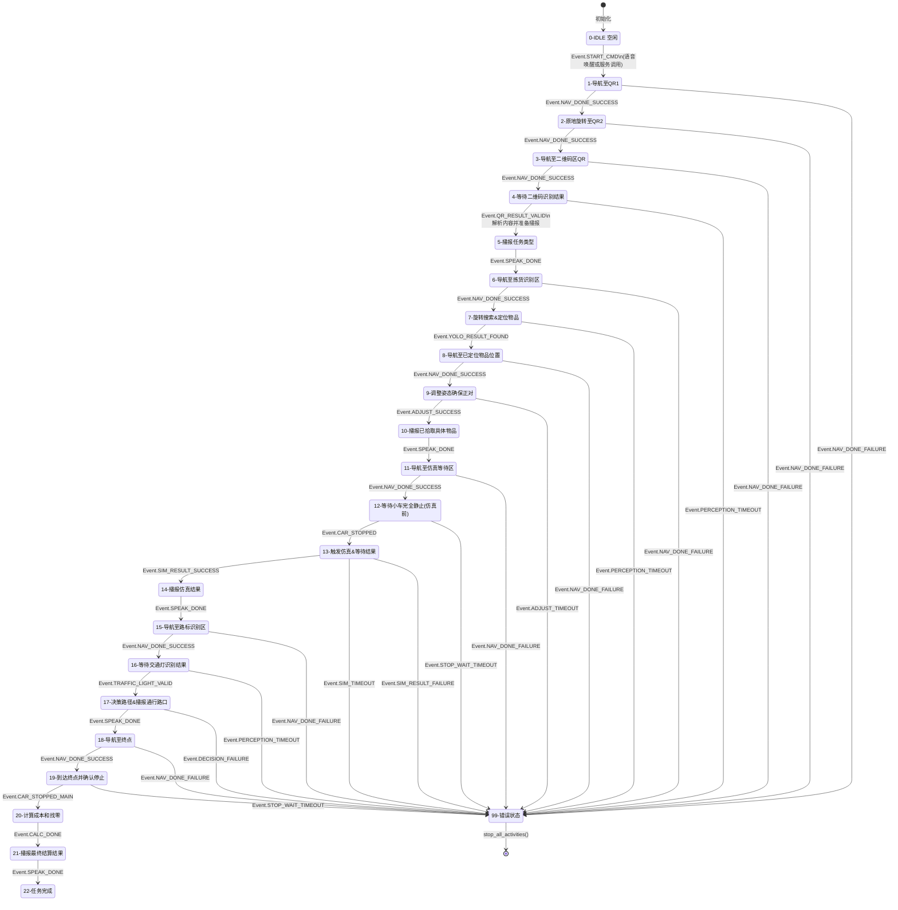

```mermaid
stateDiagram-v2
    %% 状态定义
    IDLE: 0-IDLE 空闲
    NAVIGATE_TO_QR1: 1-导航至QR1
    ROTATE_TO_QR2: 2-原地旋转至QR2
    NAVIGATE_TO_QR_AREA: 3-导航至二维码区QR
    WAIT_FOR_QR_RESULT: 4-等待二维码识别结果
    SPEAK_TASK_TYPE: 5-播报任务类型
    NAVIGATE_TO_PICKING_AREA: 6-导航至拣货识别区
    ROTATE_AND_LOCATE: 7-旋转搜索&定位物品
    NAVIGATE_TO_ITEM: 8-导航至已定位物品位置
    ADJUST_POSTURE: 9-调整姿态确保正对
    SPEAK_PICKED_ITEM: 10-播报已拾取具体物品
    NAVIGATE_TO_SIM_AREA: 11-导航至仿真等待区
    WAIT_FOR_STILLNESS: 12-等待小车完全静止(仿真前)
    TRIGGER_SIM_AND_WAIT: 13-触发仿真&等待结果
    SPEAK_SIM_RESULT: 14-播报仿真结果
    NAVIGATE_TO_TRAFFIC_AREA: 15-导航至路标识别区
    WAIT_FOR_TRAFFIC_LIGHT: 16-等待交通灯识别结果
    DECIDE_PATH_AND_SPEAK: 17-决策路径&播报通行路口
    NAVIGATE_TO_ENDPOINT: 18-导航至终点
    CONFIRM_ARRIVAL: 19-到达终点并确认停止
    CALCULATE_COST: 20-计算成本和找零
    SPEAK_FINAL_RESULT: 21-播报最终结算结果
    TASK_COMPLETE: 22-任务完成
    ERROR: 99-错误状态
    
    %% 定义初始状态
    [*] --> IDLE: 初始化
    
    %% 主要状态转换流程
    IDLE --> NAVIGATE_TO_QR1: Event.START_CMD\n(语音唤醒或服务调用)
    NAVIGATE_TO_QR1 --> ROTATE_TO_QR2: Event.NAV_DONE_SUCCESS
    ROTATE_TO_QR2 --> NAVIGATE_TO_QR_AREA: Event.NAV_DONE_SUCCESS
    NAVIGATE_TO_QR_AREA --> WAIT_FOR_QR_RESULT: Event.NAV_DONE_SUCCESS
    WAIT_FOR_QR_RESULT --> SPEAK_TASK_TYPE: Event.QR_RESULT_VALID\n解析内容并准备播报
    
    %% 继续后续流程
    SPEAK_TASK_TYPE --> NAVIGATE_TO_PICKING_AREA: Event.SPEAK_DONE
    
    NAVIGATE_TO_PICKING_AREA --> ROTATE_AND_LOCATE: Event.NAV_DONE_SUCCESS
    ROTATE_AND_LOCATE --> NAVIGATE_TO_ITEM: Event.YOLO_RESULT_FOUND
    
    NAVIGATE_TO_ITEM --> ADJUST_POSTURE: Event.NAV_DONE_SUCCESS
    ADJUST_POSTURE --> SPEAK_PICKED_ITEM: Event.ADJUST_SUCCESS
    
    SPEAK_PICKED_ITEM --> NAVIGATE_TO_SIM_AREA: Event.SPEAK_DONE
    
    NAVIGATE_TO_SIM_AREA --> WAIT_FOR_STILLNESS: Event.NAV_DONE_SUCCESS
    WAIT_FOR_STILLNESS --> TRIGGER_SIM_AND_WAIT: Event.CAR_STOPPED
    
    TRIGGER_SIM_AND_WAIT --> SPEAK_SIM_RESULT: Event.SIM_RESULT_SUCCESS
    SPEAK_SIM_RESULT --> NAVIGATE_TO_TRAFFIC_AREA: Event.SPEAK_DONE
    
    NAVIGATE_TO_TRAFFIC_AREA --> WAIT_FOR_TRAFFIC_LIGHT: Event.NAV_DONE_SUCCESS
    WAIT_FOR_TRAFFIC_LIGHT --> DECIDE_PATH_AND_SPEAK: Event.TRAFFIC_LIGHT_VALID
    
    DECIDE_PATH_AND_SPEAK --> NAVIGATE_TO_ENDPOINT: Event.SPEAK_DONE
    NAVIGATE_TO_ENDPOINT --> CONFIRM_ARRIVAL: Event.NAV_DONE_SUCCESS
    
    CONFIRM_ARRIVAL --> CALCULATE_COST: Event.CAR_STOPPED_MAIN
    CALCULATE_COST --> SPEAK_FINAL_RESULT: Event.CALC_DONE
    
    SPEAK_FINAL_RESULT --> TASK_COMPLETE: Event.SPEAK_DONE
    
    %% 错误处理转换
    NAVIGATE_TO_QR1 --> ERROR: Event.NAV_DONE_FAILURE
    ROTATE_TO_QR2 --> ERROR: Event.NAV_DONE_FAILURE
    NAVIGATE_TO_QR_AREA --> ERROR: Event.NAV_DONE_FAILURE
    WAIT_FOR_QR_RESULT --> ERROR: Event.PERCEPTION_TIMEOUT
    NAVIGATE_TO_PICKING_AREA --> ERROR: Event.NAV_DONE_FAILURE
    ROTATE_AND_LOCATE --> ERROR: Event.PERCEPTION_TIMEOUT
    NAVIGATE_TO_ITEM --> ERROR: Event.NAV_DONE_FAILURE
    ADJUST_POSTURE --> ERROR: Event.ADJUST_TIMEOUT
    NAVIGATE_TO_SIM_AREA --> ERROR: Event.NAV_DONE_FAILURE
    WAIT_FOR_STILLNESS --> ERROR: Event.STOP_WAIT_TIMEOUT
    TRIGGER_SIM_AND_WAIT --> ERROR: Event.SIM_TIMEOUT
    TRIGGER_SIM_AND_WAIT --> ERROR: Event.SIM_RESULT_FAILURE
    NAVIGATE_TO_TRAFFIC_AREA --> ERROR: Event.NAV_DONE_FAILURE
    WAIT_FOR_TRAFFIC_LIGHT --> ERROR: Event.PERCEPTION_TIMEOUT
    DECIDE_PATH_AND_SPEAK --> ERROR: Event.DECISION_FAILURE
    NAVIGATE_TO_ENDPOINT --> ERROR: Event.NAV_DONE_FAILURE
    CONFIRM_ARRIVAL --> ERROR: Event.STOP_WAIT_TIMEOUT
    
    %% 错误状态处理
    ERROR --> [*]: stop_all_activities()
    
```